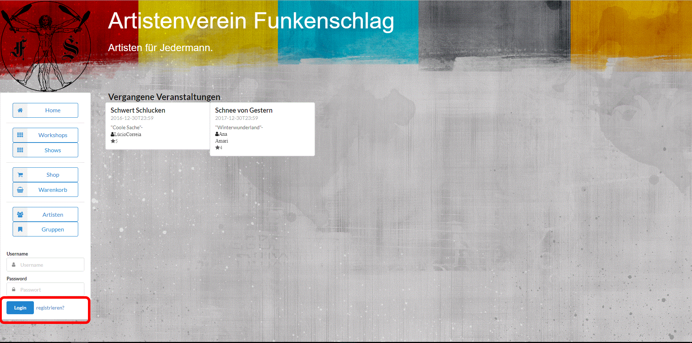
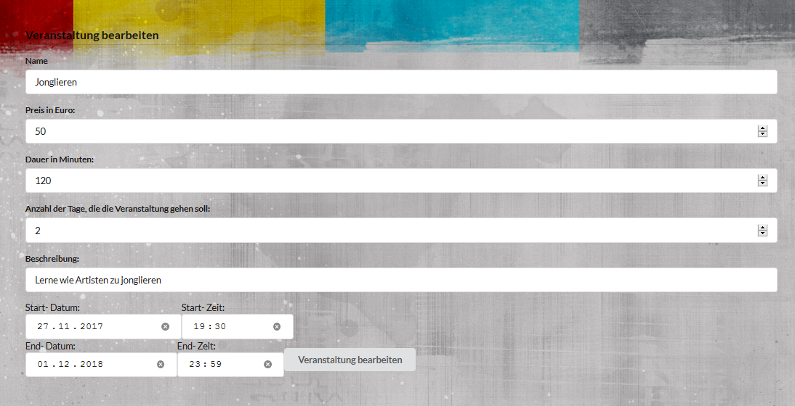

= Anwenderdokumentation

Um die Bedienung der Webseite des Artistenverein Funkenschlags zu vereinfachen, finden Sie im Folgenen eine Erklärung der diversen Funktionen.

== Login
Für die einzelnen Bereiche und Funktionen wird eventuell ein Useraccount benötigt. Dieser Account kann für einen Kunden, Artsiten oder den Vorstand sein.
Geben sie am untern ändere ihrer Naviagtionsbar Ihren Usernamen und Passwort ein und drücken anschließend auf Login
[[Login]]

== Anleitung für Kunden
*Registration:* +
Um die Registration zu beginnen, drücken Sie auf registrieren am eine ihrere Navigationsleiste
[[registrieren1]]

Auf der nächsten Seite füllen sie die leeren Felder mit ihren Daten aus. Drücken sie auf den Knopf Regstrieren. Falls Sie inkorrekte Angaben gemacht haben,
folgen sie den Anweisungen auf dem Bildschirm und korrigieren Sie den Fehler. 
[[registrieren2]]
image::Anwenderdokubilder/registrieren.png[Package diagram, 100%, 100%, pdfwidth=100%, title= "registrieren2", align=center]

*Veranstaltung buchen:* +
Um eine Veranstaltung zu buchen, müssen sie sich als Kunde eingeloggt haben.
[[VeranstaltungBuchen1]]

Wenn sie das getan haben, klicken sie im Menu auf der linken Seite auf den Tab "Workshop" oder "Show",
je nachdem, welche Art von Veranstaltung sie buchen möchten.
[[VeranstaltungBuchen2]]

Nun werden ihnen alle verfügbaren Veranstaltungen angezeigt. Klicken sie auf eine, um diese auszuwählen. 
[[VeranstaltungBuchen3]]

Jetzt werden ihnen die Details zu dieser Veranstaltung angezeigt. Klicken sie auf den Button "Veranstaltung buchen".
[[VeranstaltungBuchen4]]
image::Anwenderdokubilder/VeranstaltungBuchen4.png[Package diagram, 100%, 100%, pdfwidth=100%, title= "VeranstaltungBuchen4", align=center]

Hier können sie auswählen, zu welchem Datum die Veranstaltung stattfinden soll. Beim Ort können sie sich entweder die Vereinshalle wählen
oder einen eigenen Ort aussuchen. Klicken sie danach auf den Butten "jetzt buchen".
[[VeranstaltungBuchen5]]

Sie werden auf eine Seite weitergeleitet, wo sie eine kurze Übersicht über die Veranstaltung haben. Klicken sie auf den Button "bestätigen".
[[VeranstaltungBuchen6]]

Nun können sie unter Verwaltung auf den Tab "Kalender" drücken, wo sie einen Überblick über ihre Buchungen bekommen.
über die Buttons "Letzter Monat" und "Naechster Monat" können sie durch die einzelnen Monate navigieren.
[[VeranstaltungBuchen7]]

In der Liste unter dem Kalender sind ihre Buchungen nochmal zusammengefasst. Über den Button "Absagen" können sie die Veranstaltung absagen.
[[VeranstaltungBuchen8]]

*Artikel kaufen:* +
Um einen oder mehrere Artikel zu kaufen, müssen sie sich als Kunde eingeloggt haben.
[[ArtikelKaufen1]]

Nachdem sie sich eingeloggt haben, klicken sie im Menu auf der linken Seite auf den Tab "Shop".
[[ArtikelKaufen2]]

Mithilfe der Menuleiste über den Artikeln können sie nach einem bestimmten Artikel suchen oder die Artikel alphabetisch oder nach Preis sortieren.
[[ArtikelKaufen3]]
image::Anwenderdokubilder/ArtikelKaufen3.png[Package diagram, 100%, 100%, pdfwidth=100%, title= "ArtikelKaufen3", align=center]

Im Shop können sie sich nun details zu einem Artikel ansehen in dem sie auf ihn klicken.
[[ArtikelKaufen4]]

Ist der Artikel vorrätig und sie möchten ihn kaufen so wählen sie die gewünschte Menge aus und klicken sie auf "Hinzufügen".
[[ArtikelKaufen5]]

Sie wurden nun in den Warenkorb weitergeleitet. Wenn sie noch mehr Kaufen oder noch etwas im Shop stöbern wollen so klicken sie einfach im Menu auf "Shop". Ihr Warenkorb bleibt dabei erhalten. Sobald sie ihren Kauf abschließen möchten gelangen sie einfach wieder in ihren Warenkorb indem sie im Menu den Tab "Warenkorb" auswählen.
[[ArtikelKaufen6]]

Wenn sie bei unserem Verein einen Workshop gebucht haben, so bekommen sie im Zeitraum bis zur Veranstaltung einen Rabatt in unserem Shop.
[[ArtikelKaufen7]]

Möchten sie im Nachhinein einen Artikel aus dem Warenkotb entfernen oder die gewünschte Menge ändern, so ist dies ohne Probleme möglich. Wählen sie einfach in der Zeile des entsprechenden Artikels den Button "Löschen" aus bzw. ändern sie die Bestellmenge im Feld "Anzahl" und bestätigen sie mit dem "Button" Speichern.
[[ArtikelKaufen8]]

Sobald sie den Kauf endgültig abschließen möchten klicken sie im Warenkorb den Button "Kaufen". Sofern alle Artikel vorrätig sind wird der Kauf automatisch abgewickelt und das Geld von ihrem Konto abgebucht. Sollte dies nicht der Fall sein so befolgen sie einfach die Anweisungen in der Fehlermeldung.
[[ArtikelKaufen9]]

Möchten sie ihre getätigten Bestellungen einsehen so wählen sie im Menu auf der linken Seite den Tab "Bestellungen" aus. Hier werden alle getätigten Betellungen aufgelistet.
[[ArtikelKaufen10]]
image::Anwenderdokubilder/ArtikelKaufen10.jpg[Package diagram, 100%, 100%, pdfwidth=100%, title= "ArtikelKaufen10", align=center]

Sie können sich auch Details zu einer Bestellung anzeigen lassen indem sie auf den Button "Details" in der entsprechenden Zeile klicken.
[[ArtikelKaufen11]]

== Anleitung für Artisten:

*Veranstaltung erstellen:* +

Um eine Veranstaltung erstellen zu können müssen Sie eingeloggt sein. Klicken Sie nun in der Navigationsleiste auf den Punkt "Verwaltung"
und anschließend auf den Reiter "Veranstaltungen"
[[VeranstaltungErstellen1]]
 

Hier sehen Sie nun alle Veranstaltungen, die es bereits gibt. 
Anschließend müssen Sie sich entscheiden, ob Sie einen Workshop oder eine Show erstellen möchsten.

*Show erstellen:* +
Um eine Show zu erstellen, klicken Sie auf den Button "Show erstellen".
[[ShowErstellen1]]

Sie werden nun zu dem entsprechenden Formular weitergeleitet:
[[ShowErstellen2]]

Füllen Sie nun die Felder korrekt aus:
Als erstes sollen Sie die Gruppe anklicken, mit welcher Sie diese Veranstltung durchführen wollen. Setzten Sie dazu einfach einen Punkt in den entsprechenden Kreis.
Geben Sie nun den Namen der Veranstaltung, den Preis, die Dauer und eine Beschreibung an.
Die Felder Start-Dattum, End-Datum und Start-Zeit und End-Zeit sollen den Zeitraum festlegen, in welchem Sie die Veranstaltung anbieten wollen. 
Wenn sie alle Felder zu Ihrer Zufriedenhheit ausgefüllt haben, klicken sie auf erstellen. Wenn noch nicht alle Felder korrekt ausgefüllt wurden, folgen
Sie der Beschreibung der Fehler.
[[ShowErstellen3]]

Sie werden nun zurück zu der Übersicht über alle Shows geleitet. Dort können Sie ihre neue Show einsehen.
[[ShowErstellen4]]

*Workshop erstellen:* +
Um einen Workshop zu erstellen, klicken Sie auf den Button "Workshop erstellen".
[[WorkshopErstellen1]]

Sie werden nun zu dem entsprechenden Formular weitergeleitet:
[[WorkshopErstellen2]]

Füllen Sie nun die Felder korrekt aus:
Geben Sie nun den Namen der Veranstaltung, den Preis, die Dauer und eine Beschreibung an. Die Dauer bezieht sich bei mehrtägigen Workshops nur auf die Dauer, die an den einzelnen
Tagen errecht werden soll (in Minuten).
Das Feld "Anzahl der Tage, die die Veranstaltung gehen soll:" ist für mehrtägige Veranstaltungen gedacht. Schreiben Sie hier hinein, wie viele Tage je ein Workshop gehen soll.
Die Felder Start-Dattum, End-Datum und Start-Zeit und End-Zeit sollen den Zeitraum festlegen, in welchem Sie die Veranstaltung anbieten wollen. 
Wenn sie alle Felder zu Ihrer Zufriedenhheit ausgefüllt haben, klicken sie auf erstellen. Wenn noch nicht alle Felder korrekt ausgefüllt wurden, folgen
Sie der Beschreibung der Fehler.
[[WorkshopErstellen3]]

Sie werden nun zurück zu der Übersicht über alle Workshops geleitet. Dort können Sie ihren neuen Workshop einsehen.
[[WorkshopErstellen4]]

*Veranstaltung bearbeiten/ löschen /Artikel hinzufügen:* +
Um eine Veranstaltung bearbeiten zu können wird vorrausgesetzt, dass Sie als Artist eingeloggt sind und diese Veranstltung auch erstellt haben, bzw ein Mitglied der Gruppe sind,
welche für diese Veranstaltung verantwortlich ist. Klicken Sie nun in der Navigationsleiste entweder auf den Punkt "Workshops" oder "Shows", je nachdem, ob Sie einen Workshop
oder eine Show bearbeiten wollen. Nun klicken Sie auf die Veranstaltung, die Sie bearbeiten, löschen oder zu der Sie Artikel hinzufügen wollen. Fahren Sie nun entweder mit 
"Veranstaltung löschen", "Veranstaltung bearbeiten" oder "Artikel zu Veranstaltung hinzufügen" fort.
[[VeranstaltungBearbeiten1]]
image::Anwenderdokubilder/VeranstaltungBearbeiten1.png[VeranstaltungBearbeiten1, 100%, 100%, pdfwidth=30%, title= "VeranstaltungBearbeiten1", align=center]

*Veranstaltug bearbeiten:* +
Wenn Sie die entsprechenden Zugriffsrechte für die Veranstaaltung besitzten, sollten nun in der Detailansicht 3 Button auftauchen:"Veranstaltung bearbeiten", "Veranstaltung loeschen" und
"Artikel mit Veranstaltung verknuepfen". Sollte das nicht der Fall sein, dann ist die angeklickte Veranstaltung nicht Ihre Veranstaltung.
[[VeranstaltungBearbeiten2]]

Nun können Sie auf den Button "bearbeiten" klicken und werden zu einem Formular weitergeleitet. In diesem Formular können Sie auch die jetzigen Werte für Ihre Veranstaltung 
einsehen.
[[VeranstaltungBearbeiten3]]

Überschreiben Sie nun diejenigen Werte in den Feldern, die  Sie ändern möchten und klicken sie auf: "Veranstaltung bearbeiten". Wenn Sie nicht weitergeleitet werden, erscheint am oberen
Rand des Formulars eine Fehlermeldung. Folgen Sie Ihren Anweisungen und klicken Sie ernneut auf den "Veranstaltung bearbeiten" Button.
[[VeranstaltungBearbeiten4]]

Wenn alles gestimmt hat werden Sie wieder zur Detailansicht der Veranstaltung zurückgeleitet. Hier können Sie Ihre berichtigten Felder einsehen.

*Veranstaltung löschen:* + 
Wenn Sie sich in der Detailansicht der entsprechenden Veranstaltung befinden, klicken Sie nun auf den Button "Veranstaltung löschen." Sie werden nun entweder zurück zur Ansicht über
alle Workshops oder über alle Shows geleitet, je nachdem, ob die gelöschte Veranstaltung eine Show oder ein Workshop war. Hier können Sie nun sehe, dass die gelöschte Veranstaltung
aus der jeweiligen Liste verschwunden ist. Sie ist nun auch nicht mehr buchbar.

*Artikel zu Veranstaltung hinzufügen:* +
Aus der Detailansicht klciken Sie nun auf den Button "Artikel mit Veranstaltung verknuepfen".Sie werden nun auf eine Seite weitergeleitet, in der alle Artikel aus dem Shop 
einzeln aufgelistet sind.
[[ArtikelHinzufuegen1]]

Die Artikel, die Sie verknüpfen wollen wählen Sie nun aus, in dem Sie im Feld dahinter ein Häckchen in das Kästchen "hinzufügen" machen. Haben Sie alle Artikel ausgeählt,
die Sie verknüpfen wollen, klicken Sie unter der Tabelle auf den Button "hinzufügen!"
[[ArtikelHinzufuegen2]]

Sie werden nun wieder auf die Detailansicht der Veranstaltung weitergeleitet. Hier können Sie nun die verknüpften Artikel zu der Veranstaltung sehen.
[[ArtikelHinzufuegen3]]

*Sperrzeiten:* +
In der Verwaltungsansicht als angemeldeter Artist können Sie den Button "Sperrzeiten" auswählen, um zur Sperrzeitübersicht zu gelangen.
[[Sperrzeiten]]

Wenn Sie eine neue Sperrzeit hinzufügen möchten, geben Sie die Daten der neuen Sperrzeit ein und klicken dann auf "Neue Sperrzeit erstellen".
[[SperrzeitHinzufügen]]

Um eine Sperrzeit zu löschen klicken Sie auf den "Diese Sperrzeit löschen" Button der entsprechenden Sperrzeit.
[[SperrzeitLöschen]]
image::Anwenderdokubilder/ArtistenverwaltungSperrzeitenLöschen.png[Sperrzeitenlöschen, 100%, 100%, pdfwidth=30%, title= "Sperrzeiten löschen", align=center]

== Anleitung für Verwaltung
Nach dem Login erhalten finden Sie in der Naviagtionsbar einen Eigenen Bereich für die Verwaltung 
*Personalverwaltung:* +
Die Personalverwaltung ist unterteil in vier Teilbereiche. Jeweils einen für die Artisten- und Kundenaccounts, sowie die Artistengruppen und allgemeine Sperrzeiten für Veranstaltungen.

*Aristenverwaltung:* +

Die Aristenverwaltung hat drei grundlegende Funktionen. Die Erstellung, die Berarbeitung und zuletzt das entfernen der Useraccounts von Artisten. Für die Erstellung eines neuen Useraccounts
drücken Sie auf "hinzufügen". Die Teilbereich sind über die vier Reiter zu erreichen. +

*Artisten Erstelllen:* +
[[AristenHinzufuegen1]]
 

Auf der folgenen Seite, ähnlich dem Punkt "Registration", geben Sie alle Daten des neuen Artisten an und drücken anschließend auf den Knopf "registrieren". Wurden Fehlerhafte Eingaben gemacht, 
folgen Sie bitte den Anweisungen auf dem Bildschirm. +

[[AristenHinzufuegen2]]
  

*Artisten bearbeiten:* +
Um einen bestehenden Artisten zu bearbeiten, wähle Sie diesen in der List aus und drücken das "Stift und Papier"-Icon um mit der Berarbeitung zu beginnen +
[[AristenBearbeiten]]
 

Auf der Folgeseite erscheinen alle Daten des Artisten. Passen Sie die Daten Ihren Wünschen an und drücken sie auf "bearbeiten" um den Vorgang abzuschließen. +

Artisten löschen: * + 
Um einen Artistenaccount zu löschen, suchen Sie diesen in der Liste heraus und drücken Sie das "Löschen Symbol X" hinter dessen Namen.
[[AristenLoeschen]]
 

*Kundenverwaltung:* +
Vergleichbar mit der Aritstenverwaltung ist die Kundenverwaltung. Sie bietet die selbe Funktionalität nur in Bezug auf die Useraccounts der Kunden. Wenn sie einen Kunden Useraccount
erstellen, bearbeiten oder löschen möchten, folgen sie bitte analog den Anweisungen die Sie in der Artistenverwaltung finden. +

*Gruppenverwaltung:*
Die Gruppenverwaltung dient zur erstellung von Gruppen, sowie die Einteilung der jeweiligen Mitglieder der Gruppe. +

*Gruppe erstellen:* +
Um eine Gruppe zu erstellen drücken sie auf den Knopf Gruppe erstellen +
[[GruppeErstellen]]
 

Auf der Folgenen Seite tragen sie jediglich den Namen der neuen Gruppe ein. Bestätigten Sie diesen Namen per druch auf den Knopf "erstellen". +
[[GruppeErstellen2]]
 

Um die Mitglieder eine Gruppe zu verwalten, drücken Sie das "Stift-Icon". 
[[GruppeBearbeiten]]
 

Auf der folgenen Seite befinden sich zwei Tabellen. In der ersten Tabelle sind in grün die Mitglieder markiert, die sich bereits in der Gruppe befinden.
In rot sind jene markiert, die hinzugefügt werden können.
Wählen sie ein Mitglied aus der jeweiligen Tabelle aus und drücken sie das Kreuz icon, um ein Mitglied zu entfernen oder das Plus icon um ein Mitglied hinzu zufügen. 
[[GruppenMitglieder]]
 

*Sperrzeiten:* +
Um eine Sperrzeit anzulegen füllen sie zuerste die Eingabe Felder mit den Angaben zum Datum und der Häufigkeit. Anschließend drücken sie den Knopf "Neue Sperrzeit anlegen"
[[SperrzeitAnlegen]]
 

Zur Löschung einer Sperrzeit wählen Sie diese in der Liste aus und drücken auf "Löschen", um diese zu entfernen.
[[SperrzeitEntfernen]]
 

=== Inventarverwaltung: +
Um zur Inventarverwaltung zu gelangen, müssen Sie als Vorstand eingeloggt sein. Nun klicken Sie in der Navigationsleiste unter "Verwaltung" auf "Inventarverwaltung"

[[Inventarverwaltung1]]

Sie gelangen nun zum Bestand, wo sie die Mindestmenge der Artikel im Shop und den Rabatt einstellen können, sowie Artikel erstellen, löschen und bearbeiten können.
[[Inventarverwaltung2]]

*Mindestmenge festelgen:* +
Um die Mindestmenge festzulegen müssen Sie nur die Zahl im Kästchen unter "Mindestmenge" ändern und dann auf "speichern" klicken.
[[Mindestmenge1]]

Die neue Mindestmenge können Sie dann nach dem Speichern im gleichen Feld wieder ablesen.

*Rabatt:* +
Um den Rabatt zu ändern müssen Sie nur die Zahl im Kästchen unter "Rabatt" ändern und dann auf "speichern" klicken.
[[Rabatt1]]

Den neuen Rabatt können Sie dann nach dem Speichern im gleichen Feld wieder ablesen.

*Artikel erstellen:* +
Um Artikel zu erstellen, klicken Sie zunächst auf den Button "Artikel erstellen".
[[ArtikelErstellen1]]

Daraufhin öffnet sich ein Formular, in welchem Sie die Felder entsprechend aufüllen.
[[ArtikelErstellen2]]

Tragen Sie nun den Namen des Artikels, einen Preis und eine Beschreibung in das Formular ein. Um ein Bild auszuwählen, gehen Sie auf "Durchsuchen.. ". Daraufhin öffnet sich
ihr Dateisystem, aus dem Sie nun ein Bild auswählen können. Haben Sie alles ausgefüllt klicken Sie auf "Artikel einstellen". Werden Sie nicht weitergeleitet und kommt stattdessen
eine Fehlermeldung, führen Sie diese aus und klicken Sie erneut auf "Artikel einstellen".
[[ArtikelErstellen3]]

Wenn alle Eingaben korrekt waren, werden Sie auf die Detailseite Ihres neu erstellten Artikels weitergeleitet.

*Artikel bearbeiten:* +

Um einen Artikel zu bearbeiten, wählen Sie sich den Artikel aus der angezeigten Liste aller Artikel und klicken Sie auf "bearbeiten"
[[ArtikelBearbeiten1]]

Sie werden nun auf ein Formular weitergeleitet, wo die jetzigen Werte des Artikels bereits stehen. Bearbeiten Sie den Wert den Sie bearbeiten möchten
und klicken Sie dann auf "speichern".
[[ArtikelBearbeiten2]]

Sollte eine Fehlermeldung erscheinen, folgen Sie deren Anweisungen und klicken erneut auf "speichern". Wurden alle Werte korrekt eingegeben werden Sie auf die Detailansicht
des bearbeiteten Artikels weitergeleitet und können die bearbeiteten Werte ansehen.

*Artikel nachbestellen:* +
Auch wenn der eingestellte Mindestbestand an Artikeln noch nciht erreicht ist, können Sie die einzelnen Artikel auch so nachbestellen. Geben Sie dazu die gewünschte Anzahl des 
Artikels, der nachbestellt werden soll in das jeweilige Feld des Artikels in der Spalte "Nachbestellen" ein.
[[ArtikelNachbestellen1]]

Klicken Sie nun auf den Button "Nachbestellen" unter diesem Feld.
[[ArtikelNachbestellen2]]

Der Artikel wird nun nachbestellt und Sie können Ihn wieder in der Artikelliste finden, nun mit erhöhter Anzahl.
[[ArtikelNachbestellen3]]

Anstatt die Artikel alle einzeln nachzubestellen, können Sie auch bei mehreren Artikeln die Nachbestellungsfelder mit der gewünschten Anzahl füllen und nun ganz unten 
auf den Button "alle nachbestellen" drücken. 
[[ArtikelNachbestellen4]]

*Artikel löschen* : +
Um einen Artikel zu löschen, suchen Sie ihn einfach in der Tabelle und klicken sie anschliend in der Zeile, in welcher Sie diesen Artikel gefunden haben, auf "löschen".
[[ArtikelLoeschen]]

