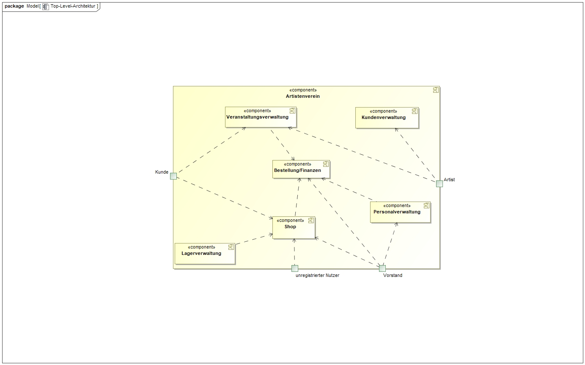
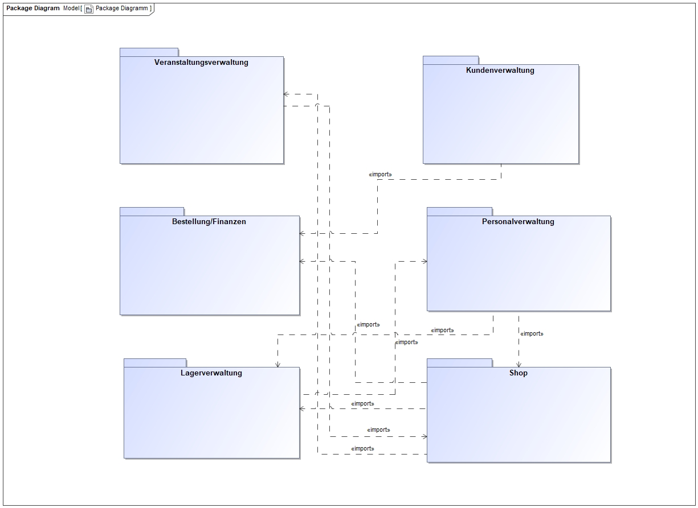
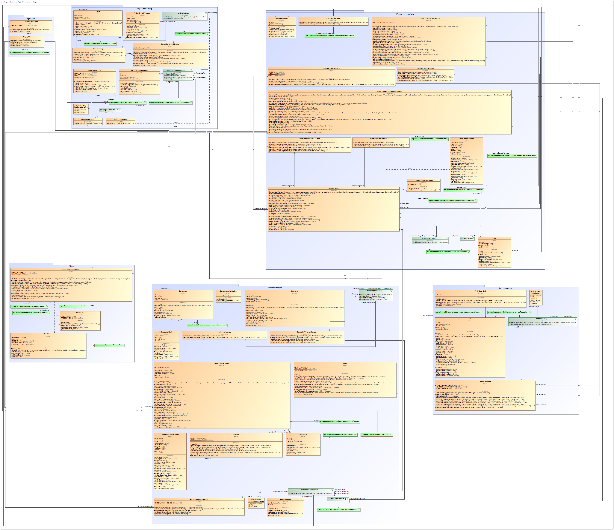
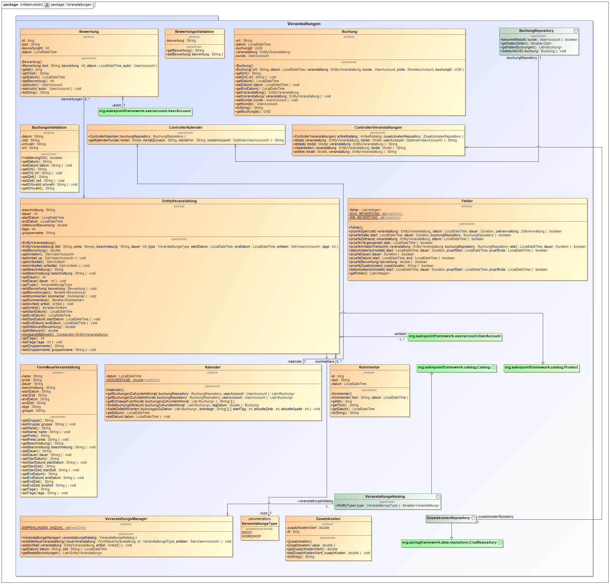
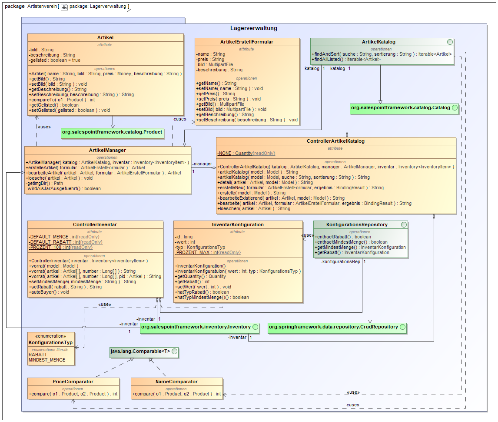
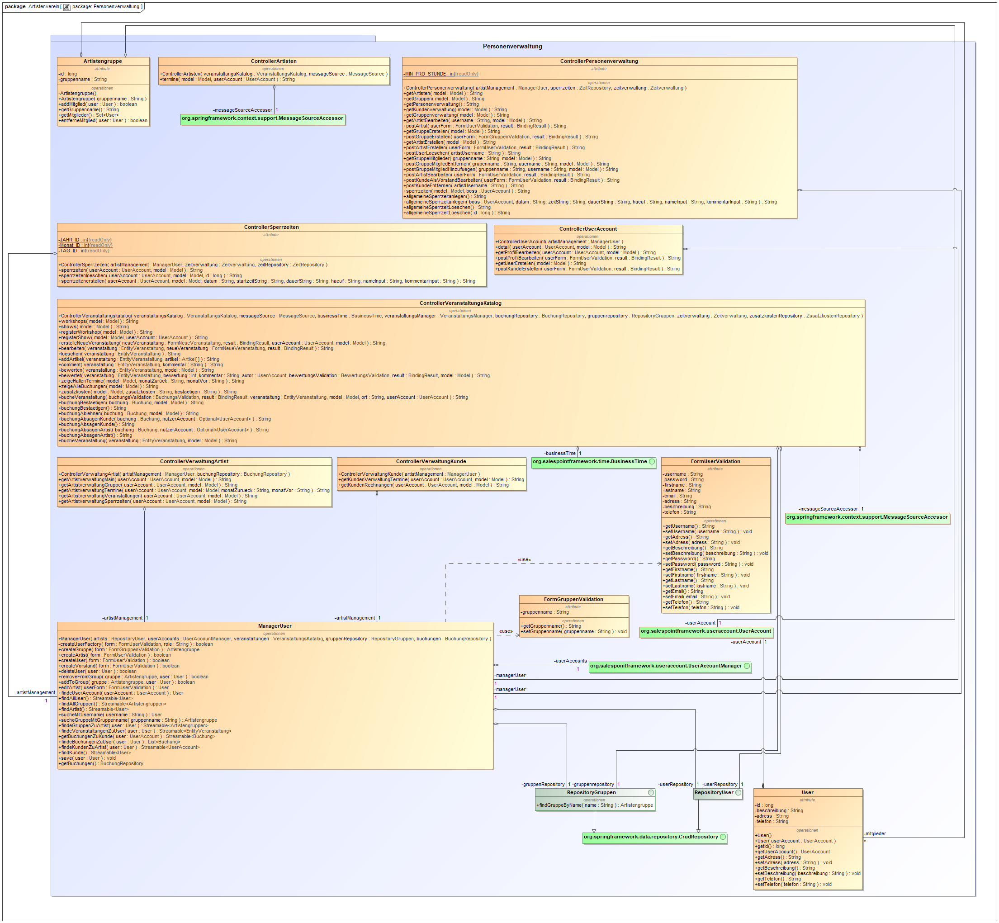
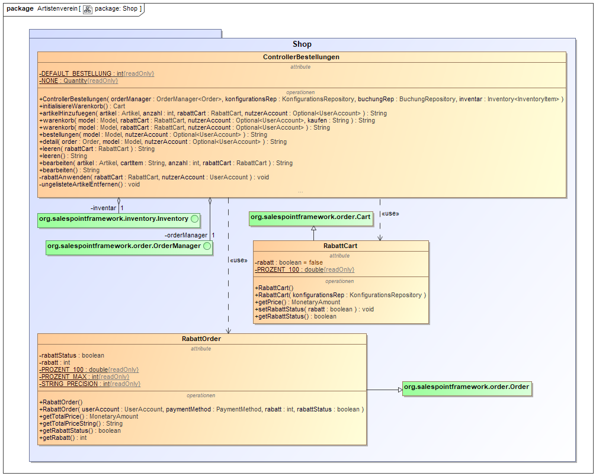
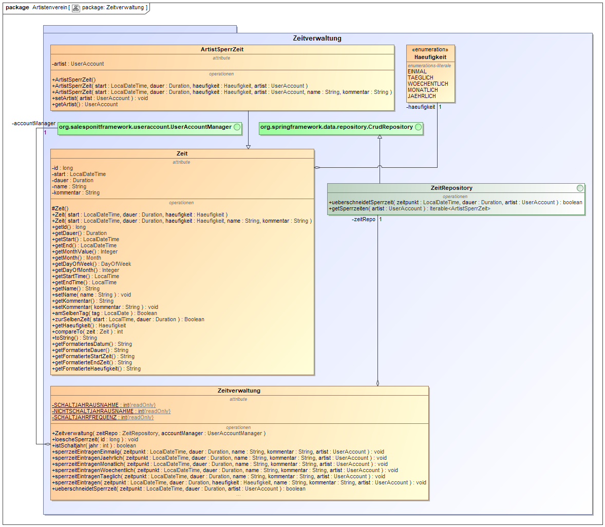
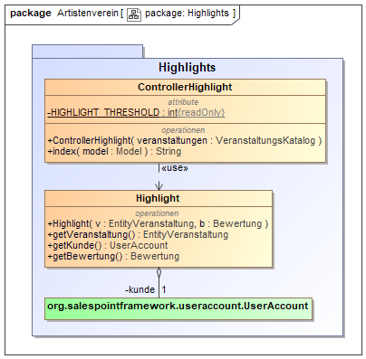

= Entwicklerdokumentation

== Einführung und Ziele
*Aufgabenstellung:* +
Der Artistenverein „Funkenschlag“ besteht aus mehreren Feuerkünstlern und Jongleuren 
verschiedenster Art. Diese bieten sowohl Workshops als auch Shows für Veranstaltungen an und benötigen hierzu eine Verwaltung ihrer Termine.
Es soll dabei eine Datenbank aufgebaut werden, in der die einzelnen Artisten und Artistengruppen mit ihren Angeboten gespeichert werden können.
Aus dieser Datenbank sollen dann über das Internet Shows und Workshops buchbar sein. Wichtig ist dass wenn ein Artist verbucht ist, dass dann auch 
Gruppenshows in denen er sonst teilnimmt nicht mehr buchbar sind. Da viele die Shows nur als zusätzliche Einnahmequelle neben ihrer normalen Beschäftigung
 nutzen, muss die Möglichkeit bestehen Sperrzeiten zu vermerken.
Für die Verwaltung der Showbuchungen, Kunden und Artistendatenbank muss ein einfaches System implementiert werden, 
auf welches nur den Artisten zugänglich ist. Hierbei sieht jeder Artist nach dem Einloggen nur seine eigenen Kunden, Shows, etc. 
Dem Vorstand des Vereins soll sich hingegen eine Zusammenfassung über alle Aktivitäten präsentieren. 
Workshops können in der vereinseigenen Halle abgehalten werden oder außerhalb. Bei Workshops außerhalb (auch mehrtägig) müssen die Kosten für Anfahrt, 
Verpflegung und Unterbringung vom Kunden übernommen werden. 
Zusätzlich zur Verwaltung der Shows und Workshops soll noch ein kleiner(!) Shop unterhalten werden. Hier werden einige Utensilien zum Jonglieren verkauft. 
Unter anderem Feuerstäbe, Pois, Jonglierbälle und Diabolos. Workshopteilnehmern soll ein Rabatt auf alle Shopartikel eingeräumt werden.

*Qualitätsziele:* +
1- sehr wichtig ... 5- nicht wichtig

[options="header", cols="3, 1, 1, 1, 1, 1"]
|===
|
|1
|2
|3
|4
|5

|Funktionalität
|
|+
|
|
|

|Zuverlässigkeit
|+
|
|
|
|

|Effizienz
|
|
|
|+
|

|Benutzbarkeit
|
|
|+
|
|

|Änderbarkeit
|
|
|+
|
|

|Validierung
|
|
|
|+
|

|===

== Randbedingungen
*Hardware-Vorgaben:*
Zum Hosten des Spring-Webservers wird ein PC benötigt, der in der Lage ist die 
Java-RE Version 1.8.x auszuführen. Empfohlen werden mindestens ein aktueller 
Dual-Core Prozessor mit 2GB RAM. (je nach vewendetem Betriebssystem und erwarteter 
Websitenutzung auch mehr). Um dauerhaften und verzögerungsarmen Zugriff auf die 
Website zu garantieren wird eine Internetleitung mit ausreichend schnellem 
Down- und Upload empfohlen.

*Software-Vorgaben:*
Die Software wurde ausschließlich in Java und Html geschrieben. Es wurden dabei das Salespoint-Framework sowie das Sprin-Framweork verwendet.
Zur Erstellung der Website wurden zudem die Template-Engine Thymeleaf sowie das CSS-Framework Semantic-UI genutzt.
Weitere Quelloffene Frameworks dürfen nach Belieben verwendet werden

*Vorgaben zum Betrieb der Software:*
Zum Betrachten der Website wird Firefox in Version 57.x oder höher oder Chrome in Version 62.x oder höher benötigt
Zum Betrieb der Software auf einem Server muss die JRE Version 1.8.x installiert sein. Zum kompilieren der Software ist das JDK in Version 1.8.x sowie der Buildmanager Maven in Version 3.5.x aufwärts erforderlich.

== Kontextabgrenzung
*Externe Schnittstellen:* +
Die Schnittstellen derSoftware sollen mit den Rollen der Nutzer übereinstimmen.
Somit gibt es Schnittstellen für folgende Gruppen: +

* User (einen Benutzer der Website, der noch nicht registriert  ist)
* Kunden (einen registrierten Benutzer)
* Artisten 
* Administrator (hier der Vorstand des Artistenvereins)

[[Top-Level-Architektur]]

== Lösungsstrategie
Kurzer Überblick über Ihre grundlegenden Entscheidungen und Lösungsansätze, die jeder, der mit der Architektur zu tun hat, verstanden haben sollte.

== Bausteinsicht

[[package_diagram]]

== Entwurfsentscheidungen
*Diagramme:* +
*Komplettes Entwurfsklassendiagramm:* +
[[Entwurfsklassendiagramm]]

*Package: Veranstaltungen:* +
[[package_Veranstaltungen]]

Das Package Veranstaltungen ist aufgebaut durch ein „Model“ und einen „Controller“ (Spring).
 Die Klasse, welche das Model repräsentiert nennt sich Veranstaltungen und die Klasse für den Controller heißt VeranstaltungsController . +
*EntityVeranstaltungen:* Sie sind diese gegliedert in Workshops und Shops. Zur Realisierung dieser Beziehung reicht 
eine Enumeration, da die Attribute und Methoden von Shows und Workshops genau dieselben sind. 
Die Klasse Veranstaltung erbt von der Salespoint-Klasse Product, um die Catalog-Klasse aus Salespoint nutzen zu können. +
*VeranstaltungsKatalog:* Diese Klasse erbt demnach von der Salespoint-Klasse Catalog und gibt die Veranstaltungen 
in einem Iterable je nach gefordertem Typ (Shop oder Workshop) zurück. +
*ControllerVeranstaltungen:* Dieser Controller erfasst die Anfragen, die mit Veranstaltungen zu tun haben, um Details der Veranstaltung anzuzeigen und gibt das Ergebniss der Anfrage zurück. +
 *Kommentar:* Diese Klasse repräsentiert einen Kommentar der unter einer Veranstaltung angezeigt wird. +
 *Bewertung:* Diese Klasse steht für eine Bewertung, die von einem Kunde zu einer Veranstaltung vergeben werden kann. +
 *Bewertungs-und Buchungensvalidation:* Diese Klassen prüfen, ob eine erstellte Bewertung/Buchung korrekte Werte besitzt, bevor
 sie entgültig erstellte werden. +
 *Buchung:* Diese Klasse repräsentiert eine gebuchte Veranstaltung, indem sie als Attribut eine EntityVeranstaltung besitzt. +
 *BuchungsRepository:* Dieses Repository enthält alle Buchungen und ermöglicht eine persistente Speicherung dieser. +
 *Zusatzkosten:* Diese Klasse repräsentiert die Zusatzkosten, wenn eine Veranstaltung außerhalb gebucht werden soll. +
 *ZusatzkostenRepository:* Diese Klasse enthält alle Zusatzkosten und liefert als Repository ein persistente Speicherung. +
 *VeranstaltungsManager:* Diese Klasse dient zur Auslagerung von Funktionen aus den Controllern des Packages in eine eigene Klasse um dem
 MVC-Pattern gerecht zu werden und einfacheres Unit-Testing zu ermöglichen. Die ausgelagerten Funktionen umfassen hierbei alles was
 im Zusammenhang mit dem Erstellen oder Bearbeiten einer Veranstaltung steht. +
 *Fehler:* Diese Klasse prüft die einzelnen Bedingungen(wie Speerzeiten oder die Halle) die zu einem Fehler führen sollen.
 In einer Liste werden dann die Fehler gespeichert. +
 *FormNeueVeranstaltung:* Diese Klasse wird dazu genutzt, um eine neue Veranstaltung zu erstellen, ohne zu viele Parameter zu übergeben müssen. +
*Kalender:* Diese Klasse enthält die Funktionen, um einen Kalender anzuzeigen und speichert ein Datum, worüber der Monat bestimmt wird, der im Moment angezeigt werden soll. Außerdem besitzt sie eine Konstante "wochenTage". +
*ControllerKalender:* Diese Klasse verwaltet die Anzeige des Kalenders, wofür die Kalender-Klasse verwendet wird. +
 
*Package: Lagerverwaltung:* +
[[package_Lagerverwaltung]]

Das Package Lagerverwaltung dient zur Modellierung der im Shop verkauften Artikel und des Lagers, das diese vorrätig hält.
 Es bedient sich dabei intensiv bei den Klassen und Interfaces des Salespoint-Frameworks und erweitert diese wenn nötig um den
 Anforderungen unseres Shops gerecht zu werden. +
*Artikel:* Die Klasse Artikel ist eine Erweiterung der Salespoint-Klasse Product. Sie fügt dieser die Felder bild und beschreibung sowie die zugehörigen get- und set-Methoden hinzu. +
*ArtikelKatalog:* Die Klasse ArtikelKatalog erweitert die Salespoint-Klasse Catalog um Artikel speichern zu können. Außerdem ermöglicht sie es Artikel zu Suchen und nach Name oder Preis zu sortieren. +
*ArtikelErstellFormular:* Das ArtikelErstellFormular dient zur Überprüfung der Eingaben beim Erstellen oder Bearbeiten eines Artikels.
 Entspricht eines der Felder nicht den Normen (ist z.B. ein String leer) so wird eine Fehlermeldung in einem BindingResult übergeben. +
*ArtikelManager:* Diese Klasse dient zur Auslagerung von Funktionen aus dem ArtikelKatalogController in eine eigene Klasse um dem
 MVC-Pattern gerecht zu werden und einfacheres Unit-Testing zu ermöglichen. Die ausgelagerten Funktionen umfassen hierbei alles was
 im Zusammenhang mit dem Erstellen oder Bearbeiten eines Artikels steht, insbesondere das Speichern und Löschen von Bildern im Dateisystem +
*ControllerArtikelKatalog:* Der ControllerArtikelKatalog erfasst alle Anfragen die im Zusammenhang mit dem Katalog oder einem Artikel stehen und delegiert diese dem MVC-Pattern entsprechend zu den verantwortlichen Klassen bzw. gibt die Ergebnisse der Anfrage zurück. +
*ControllerInventar:* Der ControllerInventar erfasst alle Anfragen die im Zusammenhang mit dem Inventar stehen und delegiert
 diese dem MVC-Pattern entsprechend zu den verantwortlichen Klassen bzw. gibt die Ergebnisse der Anfrage zurück. +
*InventarKonfiguration:* Die Klasse InventarKonfiguration modelliert wahlweise die Mindestmenge an Artikeln im Inventar oder den Rabatt im Shop und ermöglicht so das persistente Speichern dieser Werte. +
*KonfigurationsRepository:* Das KonfigurationsRepository erweitert das Spring-Crudrepository um die Klasse InventarKonfiguration speichern zu können. +
*KonfigurationsTyp:* Die Enumeration KonfugurationsTyp wird von der Klasse InventarKonfiguration verwendet um festzulegen welcher Wert con der aktuellen Instanz gespeichert wird. +
*PriceComparator:* Der PriceComparator implementiert das Java-Interface Comparable um Artikel nach ihrem Preis sortieren zu können. +
*NameComparator:* Der NameComparator implementiert das Java-Interface Comparable um Artikel nach ihrem Namen sortieren zu können. +
 
*Package: Personenverwaltung:* +
[[package_Personenverwaltung]]

Das Package Personenverwaltung repesentiert die Erstellung, Bearbeitunge und Verwaltung alle Daten mit Bezug auf Personen. +
*User:* Eine Person wird durch die Klasse User modeliert.Ihr zu grunde liegt die Salespoint Klasse UserAccount. Sie enthält Informationen zum einzigartigen Usernamen, sowie dem Passwort, Email, Vornamen, Nachnamen sowie eine zugewiesene Rolle. Die Klasse User 
erweitert diese Informationen um eine Telefonnummer und Adresse, sowie eine Beschreibung für Artisten. +
*Artistengruppe:* Dies ist eine Klasse die einen Verbund von Artisten, modeliert durch User mit der Rolle Artist modeliert. Eine Artistengruppe hat zusätzliche einen Namen. +
*ManagerUser:* Dieser Manager ermöglicht die Erstellung, verwatlung und Bearbeitungen der Objekte der Klasse User und Artistengruppe. +
*Form-GruppenValdiaton/UserValidation:* Diese Klassen stellen sicher das die Eingaben auf der Seite von Fehler und nicht erlaubten Eingaben befreit sind, bevor der UserManager damit weiterarbeitet. +
*ReposioryGruppen und ReposoryUser*: Ermöglichen die persistente Speicherung von den Klassen User und Artistengruppe. +
*Controller:* Die Unterschiedlichen Controller ermöglichen eine Kommunikation zwischen der Webseite und dem Java Programm im Hintergrund. +
*ControllerArtisten:* Übersicht über alle Artisten. +
*ControllerPersonenverwaltung:* Der Zentrale Controller im dieses Package. Im ihm Befindent sich die Verwaltungsmöglichkeiten des Vorstandes. +
*ControllerVerwaltungArtist/Kunde:*Enthält Verwaltungsaspekte die auf den jeweiligen User zugeschnitten sind. + 
 *ControllerVeranstaltungsKatalog:* Dieser Controller erfasst alle Anfragen, die irgendwie den Veranstaltungskatalog betreffen und
 gibt das Ergebniss der Anfrage zurück. +

*Package: Shop:*
[[package_Shop]]

Das Shop Package ist verantwortlich für den Warenkorb und Bestellungen. Es wird dabei das Salespointframework verwendet.
*ControllerBestellungen:* Diese Klasse verwaltet den Einkaufswagen und die getätigten Bestellungen. Sie besitzt einen OrderManager von Salespoint als Attribut um die Bestellungen zu verwalten. Funktionen sind vorhanden um Artikel in den Warenkorb zu legen, die Artikel zu kaufen oder die Bestellungen anzuzeigen. +
*RabattCart:* Die Klasse RabattCart erweitert die Salespointklasse Cart um die Rabattfunktionalität. +
*RabattCart:* Die Klasse RabattOrder erweitert die Salespointklasse Order um die Rabattfunktionalität. +

*Package: Zeitverwaltung:*
[[package_Zeitverwaltung]]

Das Zeitverwaltung Package ist verantwortlich für den Terminkalender und die Sperrzeiten der Artisten. +

*Package: Highlights:* +
[[package_Highlights]]

*Architektur:*
Wir verwenden das MVC (Model, View, Control) Model, da Spring speziell auf dieses Pattern ausgerichtet ist. Der Modelteil enthält die darzustellenden Daten wie
Benutzer- und Artistendatenbank, aber auch die Datenbank des Shops. Der View-Teil ist zuständig für die Darstellung der Daten und wird über die html-Templates
realisiert. Für den Control Teil gibt es in Spring eine spezielle Annotation. Der Quelltext dazu enthält Aktionen zur  Verarbeitung der Daten. +
*Verwendete Muster:*

*Persistenz:*
Die Daten der Verwaltungssoftware, und damit auch die Daten des Shops sollen persistent, also auch über das Aus- und wieder Anschalten der Software hinaus gehalten werden. 
Es ist zumindest eine Vorinitialisierung der Daten des Administrators (Artistenvereinvorstand) angedacht. +
*Benutzeroberfläche:*
Die Benutzeroberfläche sollte möglichst leicht verständlich aufgebaut sein. Die Benutzer sollen mit möglichst wenigen einfachen Klicks
zu ihrem Ziel gelangen und eine gut strukturierte Übersicht über ihre Daten erhalten. +

[appendix]
== Glossar
